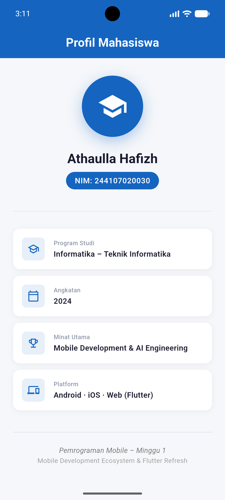
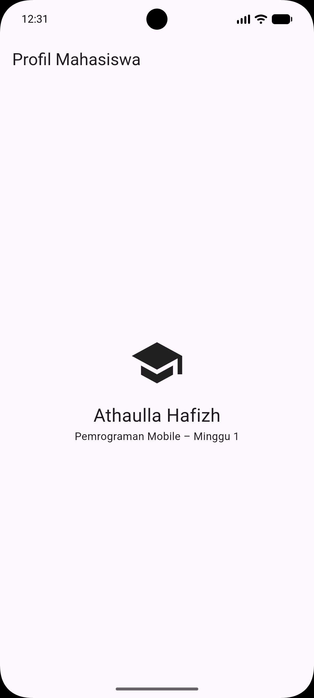

# Minggu 1 – Mobile Development Ecosystem & Flutter Refresh

## Tujuan
Memahami evolusi ekosistem pengembangan mobile (native vs cross-platform), melakukan instalasi dan verifikasi environment Flutter, menyegarkan kembali pemahaman dasar bahasa Dart (type safety, null safety, OOP), serta membuat aplikasi **Profil Mahasiswa** sebagai Mini Assignment.

---

## Fitur Utama
| Fitur | Keterangan |
|---|---|
| **Avatar** | `CircleAvatar` berisi ikon `school` dengan shadow |
| **Nama Mahasiswa** | Ditampilkan dengan `Text` + styling bold |
| **NIM Badge** | `244107020030` – tampil dalam pill/badge berwarna biru |
| **Info Cards** | Program Studi, Angkatan, Minat Utama, Platform – menggunakan widget `_InfoCard` reusable |
| **Theme** | Material 3 + `ColorScheme.fromSeed` biru navy |
| **Latihan Mandiri** | `latihan_mandiri.dart` – latihan Dart: fungsi, OOP, null safety |

---

## Stack Teknologi
- **Bahasa:** Dart 3.x (null safety penuh)
- **Framework:** Flutter SDK ≥ 3.13
- **Tools:** Android Studio Meerkat, Git, Flutter CLI
- **Testing:** `flutter_test` (widget tests)

---

## Cara Menjalankan
```bash
# 1. Masuk ke folder project
cd 01-week-1-mobile-development-ecosystem-flutter-refresh

# 2. Install dependencies
flutter pub get

# 3. Jalankan di emulator / perangkat fisik
flutter run

# 4. Jalankan test
flutter test
```

---

## Hasil yang Dicapai
- ✅ Environment Flutter berhasil dikonfigurasi (`flutter doctor` clean)
- ✅ Repository Git terstruktur 16 minggu dibuat
- ✅ Widget tree default diganti menjadi **Profil Mahasiswa** lengkap
- ✅ NIM `244107020030` ditampilkan sebagai badge biru
- ✅ Informasi tambahan: Program Studi, Angkatan, Minat Utama, Platform
- ✅ Widget test baru memverifikasi nama, NIM, AppBar, dan widget tree
- ✅ Latihan mandiri Dart: fungsi, class, null safety (`??` operator)

---

## Screenshot & Bukti Visual Mini Assignment

### Versi Terbaru (setelah upgrade Mini Assignment)


> **Keterangan gambar:**
> - 🔵 **AppBar** "Profil Mahasiswa" → widget `AppBar` + `Text`
> - 👤 **Avatar** dengan ikon `school` → widget `CircleAvatar` + `Icon`
> - 🏷️ **NIM: 244107020030** → widget `Container` (pill badge) + `Text` *(poin Mini Assignment: tambah NIM)*
> - 📋 **4 Info Card** (Program Studi, Angkatan, Minat Utama, Platform) → widget `_InfoCard` reusable *(poin Mini Assignment: informasi tambahan)*
> - 📝 **Footer** mata kuliah → widget `Text`

### Versi Awal (dari praktikum, sebelum Mini Assignment)


> Versi ini hanya menampilkan nama dan ikon — tanpa NIM dan tanpa info tambahan. Versi ini adalah **baseline** sebelum pengerjaan Mini Assignment.

---

## Kendala Setup & Solusi

### Kendala: `cmdline-tools` Android SDK tidak terdeteksi
Saat menjalankan `flutter doctor`, muncul peringatan:
```
[!] Android toolchain – Android SDK missing command line tools
    • Android SDK is missing command line tools; download them from https://developer.android.com/studio
```

**Penyebab:** Instalasi Android Studio tidak menyertakan `Android SDK Command-line Tools` secara default.

**Solusi:**
1. Buka **Android Studio → SDK Manager → SDK Tools**
2. Centang **Android SDK Command-line Tools (latest)** → Apply
3. Jalankan ulang `flutter doctor` → status berubah menjadi ✅

---

## Refleksi

### 1. Kapan native lebih tepat dipilih daripada cross-platform?

Native (Swift/Kotlin) lebih tepat ketika:
- **Performa kritis**: game 3D, AR/VR, pemrosesan kamera real-time, audio latency rendah
- **Akses hardware penuh**: API khusus platform yang belum ada bridge-nya (custom Bluetooth low-energy profile, NFC tertentu)
- **UI platform-spesifik wajib**: aplikasi yang harus mengikuti Human Interface Guidelines iOS *secara sempurna* (mis. banking app yang sudah punya design system kuat per platform)
- **Tim besar** yang sudah memiliki spesialisasi Android dan iOS terpisah — cross-platform justru menambah kompleksitas

Cross-platform (Flutter, React Native) tepat ketika: MVP cepat, tim kecil, codebase tunggal, atau fitur utama tidak bergantung pada API platform-spesifik.

---

### 2. Bagaimana perubahan state berhubungan dengan widget tree dan UI deklaratif?

Dalam Flutter, UI adalah **fungsi dari state**: `UI = f(state)`.

- Widget tree dibangun ulang (`rebuild`) setiap kali state berubah — bukan memanipulasi DOM/view secara langsung.
- `setState()` menandai widget sebagai *dirty* → Flutter memanggil ulang `build()` → menghasilkan widget tree baru.
- Flutter kemudian **membandingkan** (diffing) tree lama vs baru menggunakan *reconciliation* untuk menentukan perubahan minimal pada *render tree*.
- Hasilnya: developer hanya perlu mendeklarasikan **apa yang harus tampil** (bukan *bagaimana* mengubah UI), dan Flutter mengurus pembaruan layar secara efisien.

Contoh alur:
```
User tap → setState() → build() dipanggil → Widget tree baru → Diff → RenderObject diperbarui → Layar berubah
```

---

### 3. Mengapa commit kecil dengan pesan jelas bermanfaat bagi pekerjaan tim dan portfolio?

**Manfaat bagi tim:**
- **Traceability** – setiap perubahan memiliki alasan yang tercatat; saat bug muncul, `git bisect` dapat mempersempit commit penyebab dengan cepat
- **Code review mudah** – PR kecil lebih mudah di-review, mengurangi risiko bug lolos
- **Merge conflict minimal** – perubahan terisolasi pada satu konteks, konflik lebih mudah diselesaikan
- **Rollback aman** – `git revert` satu commit tidak merusak fitur lain

**Manfaat bagi portfolio:**
- Riwayat commit mencerminkan **proses berpikir dan disiplin kerja** developer
- Perekrut/tim dapat melihat progres nyata, bukan satu "mega commit" di akhir
- Pesan commit yang baik (`feat:`, `fix:`, `docs:`) menunjukkan pemahaman **Conventional Commits** — sinyal profesionalisme
- Menunjukkan kebiasaan kerja *incremental* yang aman dan terukur