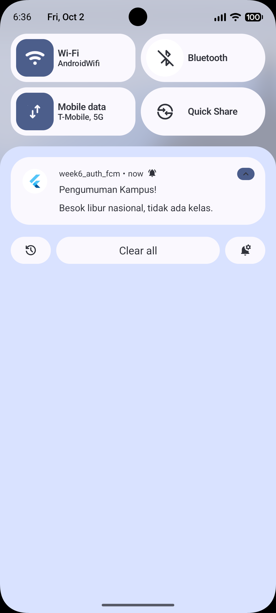

# Minggu 6 Authentication, Security & FCM

**Nama:** Athaulla Hafizh  
**NIM:** 244107020030  

---

---

## Tujuan

Praktikum ini bertujuan untuk memahami dan mengimplementasikan konsep keamanan modern dalam pengembangan aplikasi *mobile* menggunakan Flutter. Fokus utama mencakup penerapan otentikasi (JWT mock), pengamanan *token* rahasia menggunakan penyimpanan terenkripsi (`flutter_secure_storage`), serta pengintegrasian Firebase Cloud Messaging (FCM) secara menyeluruh. Selain itu, tahapan ini juga membahas arsitektur penanganan rotasi token, strategi intersepsi *error* 401 (Refresh Token), hingga navigasi responsif (*Deep Linking*) pada tiga status siklus hidup aplikasi (*Foreground*, *Background*, dan *Terminated*).

## Fitur Utama

| Fitur | Keterangan |
|---|---|
| Autentikasi & Secure Storage | Sistem *Login* terproteksi oleh *GoRouter Guard*, dengan penyimpanan *access token* dan *refresh token* yang dienkripsi secara penuh oleh OS (Keystore/Keychain) |
| Interceptor 401 Terpusat | Modul *Dio* yang dirancang cerdas untuk otomatis melakukan penyegaran (*refresh*) token saat sesi kedaluwarsa, tanpa memutus pengalaman pengguna |
| Firebase Cloud Messaging (FCM) | Penerimaan notifikasi berbasis *Push* yang terintegrasi penuh untuk pengiriman pesan personal (*Device Token*) maupun pesan massal (*Topic*) |
| Deep Linking Multistatus | Intersepsi ketukan (*click*) *banner* notifikasi yang mampu melempar pengguna (*redirect*) ke layar spesifik secara akurat baik saat aplikasi menyala, sembunyi, maupun mati |

---

## Tahapan Praktikum

### Praktikum 1: Login + Secure Storage + Token Refresh
  

> **Keterangan gambar**
> - Kerangka halaman *Login* dikunci menggunakan _Guard_ dari *GoRouter*.
> - *Access* dan *refresh token* disimpan secara aman (enkripsi native) ke dalam brankas `flutter_secure_storage`.
> - Sistem otomatis menangani siklus penyegaran token (401 Unauthorized) melalui *interceptor* API secara asinkron.

### Praktikum 2: FCM, Permission, dan Token Lifecycle
  

> **Keterangan gambar**
> - Aplikasi dihubungkan ke Firebase dengan mengaktifkan izin notifikasi eksplisit (khususnya untuk *rule* Android 13+ `POST_NOTIFICATIONS`).
> - Token identitas perangkat (*FCM Token*) berhasil ditangkap, lalu tampilannya dipotong (*truncate*) pada UI UI (batas 12 karakter) guna menaati protokol pencegahan kebocoran rahasia.

### Praktikum 3: Payload, Tiga App State, Klik dan Topik
  

> **Keterangan gambar**
> - Pengujian mendalam pengiriman *Campaign Payload* berupa *custom JSON data* (`route: /pengumuman/3`) pada ketiga mode siklus hidup (State) aplikasi.
> - **Foreground**: Memicu notifikasi lokal buatan sendiri (tanpa campur tangan OS).
> - **Background**: Memicu spanduk OS standar; klik diarahkan langsung via `onMessageOpenedApp`.
> - **Terminated**: *Cold boot* (menyala dari mati total) ditangani secara mulus via `getInitialMessage`.

### Refactoring & Testing

> **Keterangan gambar**
> - Navigasi *Deep Link* diekstrak ke dalam parameter statis `routes.dart` agar mudah diakses berbagai file.
> - Translasi *Error Server* dibungkus ke `api_errors.dart` agar layar UI menampilkan pesan Bahasa Indonesia yang ramah alih-alih tulisan _DioException_.
> - Implementasi *Unit Test* (`auth_push_test.dart`) menghasilkan centang hijau sempurna tanpa _error_, bersamaan dengan hasil lolos sensor *Flutter Analyze*.

---

## AI Prompt Challenge

Seluruh modifikasi dan eksperimentasi integrasi awal antara _FCM_ dengan asisten _AI (Prompt Engineering)_ (termasuk verifikasi isolasi UI dari proses latar belakang, penemuan *bug linter* argument API, dan pembuktian *Lifecycle*) telah saya dokumentasikan di berkas terpisah secara ekstensif.

👉 [**Lihat Pembahasan Lengkap AI Challenge (AI_Challenge.md)**](docs/AI_Challenge.md)

---

## Refleksi

**1. Mengapa refresh token tidak boleh disimpan di SharedPreferences? Apa risikonya bila bocor?**

`SharedPreferences` menyimpan data dalam bentuk *plain-text* murni tanpa enkripsi sedikit pun. Bila perangkat Android berhasil dibobol (di-*root* atau disusupi *malware* pembaca _file directory_), peretas dapat dengan mudah mencuri `refresh_token` (yang biasanya berumur panjang hingga hitungan minggu/bulan) untuk mengambil alih sesi pengguna secara utuh (*Account Takeover*). Penggunaan `flutter_secure_storage` (yang diamankan langsung oleh _OS Keystore/Keychain_) adalah syarat mutlak dalam standar perbankan/industri.

**2. Apa yang rusak bila onTokenRefresh diabaikan selama satu semester perkuliahan?**

Token identitas unik perangkat (*FCM Token*) sewaktu-waktu dapat dirotasi (diganti) secara sepihak oleh Google (misalnya: masa kedaluwarsa habis, aplikasi dihapus-pasang ulang, atau perombakan sistem *security* server). Jika aplikasi tidak memberikan *callback* penyegaran token baru ini ke backend (*via onTokenRefresh*), maka *server* kampus akan selamanya memegang *"Token Basi"* (stale). Akibatnya, seluruh notifikasi kritis mahasiswa (seperti nilai keluar atau tagihan) akan selalu **gagal dikirimkan *(bouncing)*** tanpa sepengetahuan sistem.

**3. Kapan memakai topik dan kapan memakai token perangkat? Beri contoh pesan kampus untuk masing-masing.**

- **Topik (*Topic*)**: Sangat efisien untuk komunikasi publik atau *broadcast* (siaran massal) ke banyak perangkat yang tergabung pada kelompok sama. Contoh: Pesan "Perkuliahan besok pagi ditiadakan karena libur nasional" yang ditembakkan cukup sekali ke topik `pengumuman-kampus`.
- **Token Perangkat (*Device Token*)**: Hanya digunakan untuk menarget identitas spesifik yang sifat datanya konfidensial/rahasia (*One-to-One*). Contoh: Surat peringatan (SP) karena absensi buruk, tagihan sisa UKT yang belum dibayar, atau notifikasi nilai _KHS_ semester yang baru terbit.

**4. Bagian mana dari draf AI yang Anda tolak atau perbaiki, dan mengapa?**

- **Format Argumen Lokal Notifikasi**: Saya mengganti format susunan parameter dari usulan awal AI yang masih kuno menjadi pola *Named Parameter* (`id:`, `title:`, `settings:`), sebab *plugin* `flutter_local_notifications` versi 22.0.0 ke atas sudah sepenuhnya memblokir format lama.
- **Keamanan Token (Log Truncating)**: Kode awal AI mencetak (`print`) token secara utuh panjang-lebar. Saya secara manual memodifikasi kodenya agar disensor: `token.length > 12 ? '${token.substring(0, 12)}...' : token;` untuk menjaga rahasia saat tangkapan layar debug terjadi.
- **Izin AndroidManifest**: Usulan kodingan _permission_ awal AI gagal bekerja secara diam-diam di Emulator Android 13+. Saya harus membongkar direktori lokal dan menambah baris `<uses-permission android:name="android.permission.POST_NOTIFICATIONS"/>` langsung di *manifest* *Native* Android agar siklus OS terpicu dengan benar.

---

## Referensi
- [Slide Week 6: Authentication, Security & FCM](https://jti-polinema.github.io/flutter-codelab/00-slides/Week_06_Authentication_Security_FCM.html)
- [FCM Flutter client (setup & token)](https://firebase.google.com/docs/cloud-messaging/flutter/client)
- [FCM message types: notification vs data](https://firebase.google.com/docs/cloud-messaging/concept-options)
- [Firebase Auth for Flutter](https://firebase.google.com/docs/auth/flutter/start)
- [flutter_secure_storage package](https://pub.dev/packages/flutter_secure_storage)
- [flutter_local_notifications package](https://pub.dev/packages/flutter_local_notifications)
- [GoRouter: redirect & deep linking](https://go_router.dev/)
- [OWASP Mobile Top 10](https://owasp.org/www-project-mobile-top-10/)
- [Learn Dart in Y Minutes](https://learnxinyminutes.com/dart/)
