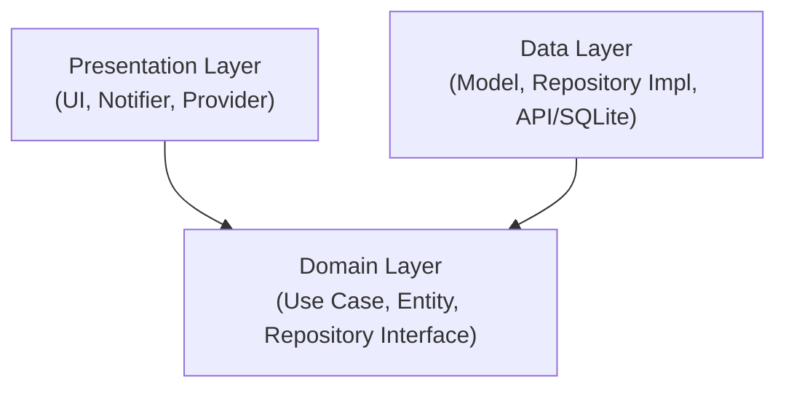

# Minggu 7 Clean Architecture

**Nama:** Athaulla Hafizh  
**NIM:** 244107020030  

---

## Tujuan

Repositori ini adalah kelanjutan dari refactoring aplikasi **Campus Notify** menjadi struktur **Feature-First Clean Architecture**. Tujuan utama dari proyek ini adalah untuk membuktikan pemisahan lapisan (Separation of Concerns), sterilisasi *Domain* dari hal berbau *Framework/Package*, dan mempermudah eksekusi *Unit Test* independen tanpa memerlukan koneksi langsung ke SQLite, API (Dio), atau Firebase.

## Arsitektur

Pola yang diterapkan memecah setiap fitur (`auth`, `announcement`, `notes`) menjadi 3 lapisan (Layers). Aturan emasnya (Dependency Rule): **Dependensi hanya boleh mengarah ke dalam (ke Domain Layer).**


*Catatan: Layer Data bergantung pada Domain untuk mengimplementasikan kontrak Interface, sedangkan Presentation memanggil logika bisnis melalui Use Case.*

## Fitur Utama

| Fitur | Keterangan |
|---|---|
| Pemisahan Entitas & Model | Semua kelas `Entity` murni Dart, sementara proses mapping (JSON/Map) diisolasi hanya pada `Model` |
| Error Handling Terpusat | Seluruh error infrastruktur (DioException, SQFlite error) dicegat pada layer `Data` dan diterjemahkan menjadi *Sealed Class* `Failure` pada layer `Domain` |
| Sterilitas Ekstrim | Lapisan *Presentation* bebas dari instansiasi `Dio/SQLite` (100% bergantung pada injeksi via Riverpod) |
| Mock Testing | Semua `Use Case` diuji (11 Unit Test lulus) menggunakan metode `FakeRepository` tanpa menyentuh *database* atau REST API sesungguhnya |

## Stack Teknologi

- **Core Framework**: Flutter (Dart)
- **Dependency Injection & State**: Riverpod
- **Routing**: GoRouter
- **Local Database**: SQFlite, Flutter Secure Storage
- **Networking**: Dio
- **Formatting**: Intl

---

## Tahapan Praktikum & Bukti Eksekusi Verifikasi Mandiri

**1. Presentation Steril dari Akses Infrastruktur Mentah**
```bash
PS> Select-String -Path "lib\features\*\presentation\*\*.dart" -Pattern "Dio\(|openDatabase|getDatabasesPath|FlutterSecureStorage|SharedPreferences\.getInstance|jsonDecode"

# (NOL HASIL)
```
**2. Domain Steril dari Framework & Library Infrastruktur**
```bash
PS> Select-String -Path "lib\features\*\domain\*\*.dart", "lib\core\*.dart" -Pattern "import 'package:flutter|import 'package:dio|import 'package:sqflite|import 'package:firebase"

# (NOL HASIL)
```
**3. Static Analysis & Unit Test**
```bash
PS> flutter analyze
No issues found! (ran in 2.4s)

PS> flutter test
00:00 +11: All tests passed!
```

---

## Refleksi Mingguan

### 1. Mengapa interface repository harus tinggal di domain, bukan di data? Apa yang rusak bila dibalik?
Interface (*abstract class*) hidup di Domain sebagai kontrak (aturan). Jika Interface dipindah ke Data, maka Domain (Use Case) harus mengimpor file dari layer Data agar mengetahui tipe balikan datanya. Ini melanggar *Dependency Rule* di mana Domain tidak boleh tahu-menahu soal Data layer. Selain itu, ini akan menghambat kemampuan melakukan *mocking* untuk *unit testing*.

### 2. Kapan use case benar-benar dibutuhkan, dan kapan repository langsung ke notifier sudah cukup?
*Use Case* sangat penting saat sebuah proses melibatkan lebih dari 1 repository (misalnya: *fetch* dari internet API, lalu simpan datanya ke SQLite lokal) atau jika terdapat perhitungan matematis dan validasi bisnis yang kompleks. Sebaliknya, *Repository* langsung ditembak melalui *Notifier* cukup bila operasinya hanya sekadar "CRUD satu-baris" murni (baca langsung tampilkan) tanpa manipulasi apa-apa.

### 3. Apa biaya over-engineering (use case per CRUD satu-baris) bagi tim kecil? Kapan biayanya sepadan?
Bagi tim kecil, membuat Use Case kosong hanya untuk meneruskan pemanggilan satu baris fungsi Repository akan menguras waktu, menambah ribuan *boilerplate code*, dan membingungkan rekrutan baru. Biayanya akan sepadan hanya pada proyek *Enterprise* raksasa yang mungkin harus bisa me-*swap* framework (misal dari React Native ke Flutter tapi logic Dart tetap) dan memfasilitasi tim *Quality Assurance* independen.

### 4. Bagian mana dari usulan AI yang Anda tolak atau sederhanakan, dan mengapa?
Pada awal draf struktur (terekam pada `docs/AI_Challenge.md`), AI mengusulkan pemakaian _package_ fungsional `dartz` agar fungsi mereturn `Either<Failure, T>`. Saya menolaknya secara tegas dan menggantinya dengan fitur bawaan Dart 3.0 yaitu *Records* (`({T? data, Failure? failure})`) dipadukan dengan `AsyncValue.guard` dari Riverpod. Langkah ini menekan ketergantungan pada *library* pihak ketiga sambil mendapatkan hasil yang identik secara fungsional (bebas lemparan *exception* tak terduga).

---
*Seluruh analisis detail terkait usulan vs final decision AI terdapat di folder `docs/AI_Challenge.md`.*
*Seluruh pembuktian visual aplikasi sebelum vs sesudah refactoring (bersama uji terminal) dapat diakses pada folder `screenshots/`.*
