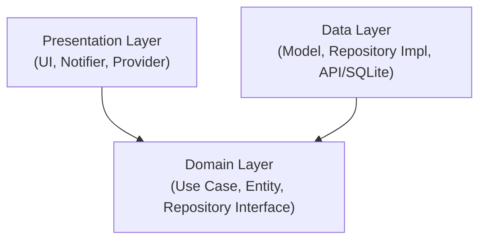

# Minggu 7 Clean Architecture

**Nama:** Athaulla Hafizh  
**NIM:** 244107020030  

---

## Tujuan

Repositori ini adalah kelanjutan dari refactoring aplikasi **Campus Notify** menjadi struktur **Feature-First Clean Architecture**. Tujuan utama dari proyek ini adalah untuk membuktikan pemisahan lapisan (Separation of Concerns), sterilisasi *Domain* dari hal berbau *Framework/Package*, dan mempermudah eksekusi *Unit Test* independen tanpa memerlukan koneksi langsung ke SQLite, API (Dio), atau Firebase.

## Arsitektur

Pola yang diterapkan memecah setiap fitur (`auth`, `announcement`, `notes`) menjadi 3 lapisan (Layers). Aturan emasnya (Dependency Rule): **Dependensi hanya boleh mengarah ke dalam (ke Domain Layer).**

*Catatan: Layer Data bergantung pada Domain untuk mengimplementasikan kontrak Interface, sedangkan Presentation memanggil logika bisnis melalui Use Case.*

## Fitur Utama

| Fitur | Keterangan |
|---|---|
| Pemisahan Entitas & Model | Semua kelas `Entity` murni Dart, sementara proses mapping (JSON/Map) diisolasi hanya pada `Model` |
| Error Handling Terpusat | Seluruh error infrastruktur (DioException, SQFlite error) dicegat pada layer `Data` dan diterjemahkan menjadi *Sealed Class* `Failure` pada layer `Domain` |
| Sterilitas Ekstrim | Lapisan *Presentation* bebas dari instansiasi `Dio/SQLite` (100% bergantung pada injeksi via Riverpod) |
| Mock Testing | Semua `Use Case` diuji (11 Unit Test lulus) menggunakan metode `FakeRepository` tanpa menyentuh *database* atau REST API sesungguhnya |

---

## Tahapan Praktikum

### Praktikum 1: Clean Architecture pada Fitur Lama
  

> **Keterangan gambar**
> - Folder disusun ulang menggunakan format *feature-first* (dibagi per fitur, lalu dibagi per *layer*).
> - UI aplikasi tetap berjalan 100% identik tanpa perubahan *behavior* visual setelah perombakan arsitektur besar-besaran.

### Praktikum 2: Entity Murni, Failures, dan Local DB
  

> **Keterangan gambar**
> - *Entity* dipastikan 100% murni Dart dan tidak dicemari logika konversi `fromJson` / `toJson`.
> - Menggunakan pola *Sealed Class* untuk standarisasi tipe *Failure* yang akan dicegat di UI.
> - Pendekatan *Records* standar Dart 3 digunakan pada Repository untuk mengembalikan nilai berganda (Sukses / Gagal) secara aman tanpa *exception* liar.

### Praktikum 3: Presentation, DI, dan Verifikasi
  

> **Keterangan gambar**
> - Implementasi Dependency Injection (DI) Riverpod untuk menghubungkan *Repository* ke antarmuka pengguna tanpa *package* tambahan.
> - Pencarian terminal (`grep`) membuktikan bahwa Layer Domain dan Presentation sudah steril dari impor *package* liar seperti `dio`, `sqflite`, maupun `flutter/material` di dalam kelas Use Case.
> - Halaman fitur *Catatan Pribadi* beroperasi menggunakan isolasi *Data Layer* SQLite yang rapi.

### Refactoring & Testing

> **Keterangan gambar**
> - Fungsi ekstraksi format tanggal (*formatting*) dipisah menjadi fungsi utilitas murni agar *testable*.
> - Penulisan pengujian unit terisolasi (Unit Test) menggunakan `FakeNoteRepository` berjalan mulus.
> - Keseluruhan 11 tes pada Use Case dan *analyzer linter* lulus sempurna tanpa satupun galat (*error/warning*).

---

## AI Prompt Challenge

Diskusi detail bersama *AI Assistant* tentang migrasi proyek `campus_notify` ke *Clean Architecture*, termasuk perdebatan terkait *over-engineering* fungsi CRUD, serta persetujuan *trade-off* teknis, dicatat rapi pada dokumen terpisah.

👉 [**Lihat Pembahasan AI Challenge (AI_Challenge.md)**](docs/AI_Challenge.md)

---

## Refleksi

**1. Mengapa interface repository harus tinggal di domain, bukan di data? Apa yang rusak bila dibalik?**

Interface (*abstract class*) hidup di Domain sebagai kontrak (aturan). Jika Interface dipindah ke Data, maka Domain (Use Case) harus mengimpor file dari layer Data agar mengetahui tipe balikan datanya. Ini melanggar *Dependency Rule* di mana Domain tidak boleh tahu-menahu soal Data layer. Selain itu, ini akan menghambat kemampuan melakukan *mocking* untuk *unit testing*.

**2. Kapan use case benar-benar dibutuhkan, dan kapan repository langsung ke notifier sudah cukup?**

*Use Case* sangat penting saat sebuah proses melibatkan lebih dari 1 repository (misalnya: *fetch* dari internet API, lalu simpan datanya ke SQLite lokal) atau jika terdapat perhitungan matematis dan validasi bisnis yang kompleks. Sebaliknya, *Repository* langsung ditembak melalui *Notifier* cukup bila operasinya hanya sekadar "CRUD satu-baris" murni (baca langsung tampilkan) tanpa manipulasi apa-apa.

**3. Apa biaya over-engineering (use case per CRUD satu-baris) bagi tim kecil? Kapan biayanya sepadan?**

Bagi tim kecil, membuat Use Case kosong hanya untuk meneruskan pemanggilan satu baris fungsi Repository akan menguras waktu, menambah ribuan *boilerplate code*, dan membingungkan rekrutan baru. Biayanya akan sepadan hanya pada proyek *Enterprise* raksasa yang mungkin harus bisa me-*swap* framework (misal dari React Native ke Flutter tapi logic Dart tetap) dan memfasilitasi tim *Quality Assurance* independen.

**4. Bagian mana dari usulan AI yang Anda tolak atau sederhanakan, dan mengapa?**

Pada awal draf struktur (terekam pada `docs/AI_Challenge.md`), AI mengusulkan pemakaian _package_ fungsional `dartz` agar fungsi mereturn `Either<Failure, T>`. Saya menolaknya secara tegas dan menggantinya dengan fitur bawaan Dart 3.0 yaitu *Records* (`({T? data, Failure? failure})`) dipadukan dengan `AsyncValue.guard` dari Riverpod. Langkah ini menekan ketergantungan pada *library* pihak ketiga sambil mendapatkan hasil yang identik secara fungsional (bebas lemparan *exception* tak terduga).

---

## Referensi

- [Slide Week 7: Clean Architecture](https://jti-polinema.github.io/flutter-codelab/00-slides/Week_07_Clean_Architecture.html)
- [Flutter: App architecture guide](https://docs.flutter.dev/app-architecture/guide)
- [The Clean Architecture (Robert C. Martin)](https://blog.cleancoder.com/uncle-bob/2012/08/13/the-clean-architecture.html)
- [Riverpod: Providers & dependency injection](https://riverpod.dev/docs/concepts/providers)
- [Dart: Records (return ganda sukses/gagal)](https://dart.dev/language/records)
- [fpdart package (alternatif Either)](https://pub.dev/packages/fpdart)
- [GoRouter: redirect & deep linking](https://go_router.dev/)
- [Learn Dart in Y Minutes](https://learnxinyminutes.com/dart/)
